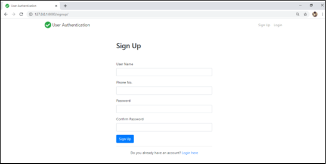
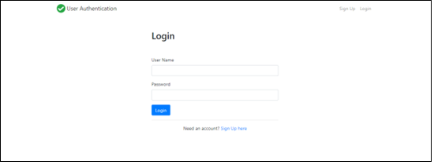
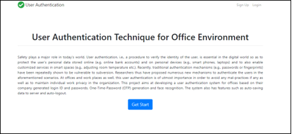
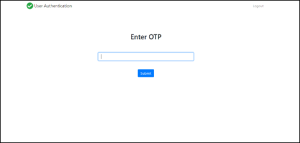
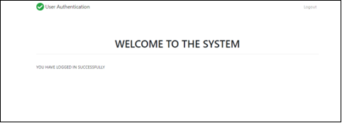
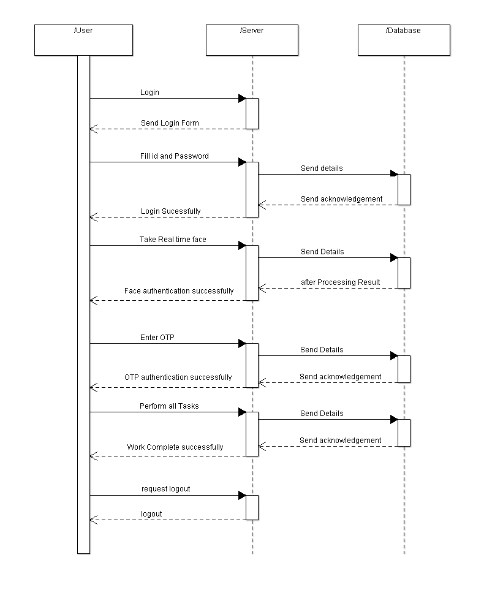
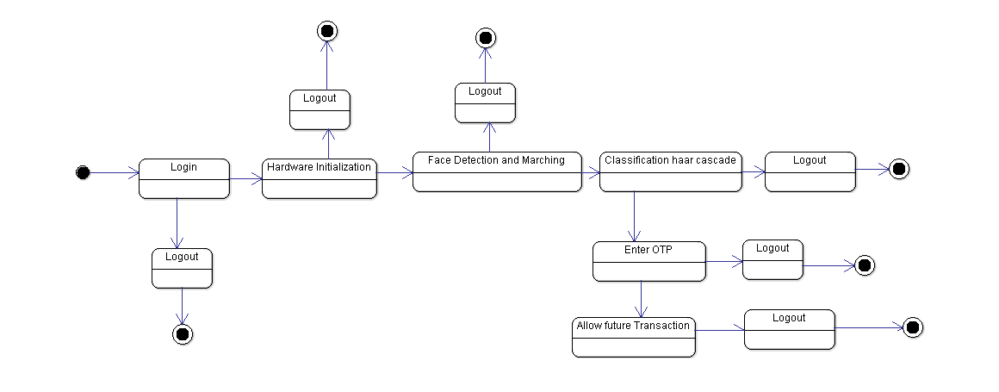
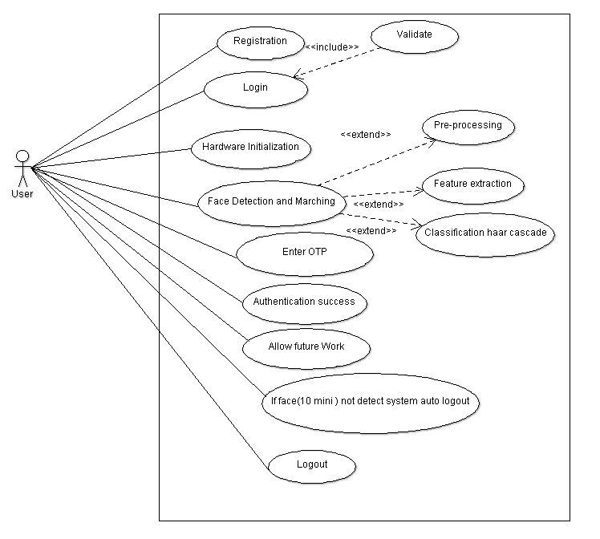

# Machine Learning-Based Security System for Office Premises

## Overview
This project is a **User Authentication System** designed for office environments, integrating multiple security layers, including **login credentials, face recognition, and One-Time Password (OTP) verification**. The system enhances security by ensuring only authorized users can access office systems, leveraging **machine learning-based face recognition and OTP mechanisms**. 

## Features
- **Multi-Factor Authentication (MFA)**: Combines login credentials, face recognition, and OTP.
- **Face Recognition**: Uses **Haar Cascade Classifier** for live authentication.
- **OTP Verification**: Generates a **One-Time Password** for an additional security layer.
- **Auto-Logout**: Logs out the user if an unauthorized face is detected or after a set time.
- **Auto-Save Feature**: Saves the user’s work on logout or unauthorized access detection.
- **Secured Data Access**: Implements role-based access control (RBAC) and **AES encryption** for sensitive data.

## System Flow
### 1. **User Registration & Login**


- A user registers with a **Username, Phone Number, Password**.
- Upon login, credentials are verified against the database.

### 2. **Face Recognition Authentication**

- The system captures the **real-time face image** using a webcam.
- Matches the captured image against the stored face data.
- If face authentication fails, login is denied.

### 3. **OTP Authentication**

- If face recognition is successful, an OTP is sent to the registered phone number.
- User enters the OTP for final verification.
- If OTP matches, access is granted.

### 4. **Secure Session Management**

- Auto-logout occurs when the user leaves the system unattended.
- If an unauthorized face is detected, the session is terminated.
- Work is auto-saved before logout.

## System Architecture
The system consists of three main components:
- **User Interface (Frontend)**: HTML, CSS, JavaScript (React optional)
- **Backend**: Flask/Django (Python)
- **Database**: MySQL/PostgreSQL (User data storage, authentication logs)

## Sequence Diagram

The **Sequence Diagram** shows the step-by-step interaction between the **User, Server, and Database**:
- **Login Request → Server Validates Credentials → Face Authentication → OTP Validation → Successful Login → Access System.**

## State Diagram

The **State Diagram** outlines system behavior:
- **Login → Hardware Initialization → Face Detection → OTP Entry → Secure Work Session → Logout.**

## Use Case Diagram

The **Use Case Diagram** represents key functionalities:
- **User actions: Registration, Login, Hardware Initialization, Face Detection, OTP Entry, Authentication, Secure Session, Logout.**

## Installation & Setup
### Prerequisites
- Python 3.8+
- Flask/Django
- OpenCV for face recognition
- Twilio API (for OTP services)
- MySQL/PostgreSQL

### Steps to Run
1. **Clone the Repository**
   ```sh
   git clone https://github.com/your-repo/user-authentication.git
   cd user-authentication
   ```
2. **Create Virtual Environment** (Optional but Recommended)
   ```sh
   python -m venv env
   source env/bin/activate  # On Windows: env\Scripts\activate
   ```
3. **Install Dependencies**
   ```sh
   pip install -r requirements.txt
   ```
4. **Set Up Database**
   - Configure database settings in `config.py`
   - Run migrations:
   ```sh
   python manage.py migrate  # For Django
   flask db upgrade  # For Flask with SQLAlchemy
   ```
5. **Start the Server**
   ```sh
   python app.py  # For Flask
   python manage.py runserver  # For Django
   ```
6. **Access the Application**
   Open your browser and go to `http://127.0.0.1:5000/` (Flask) or `http://127.0.0.1:8000/` (Django).

## Technologies Used
- **Frontend:** HTML, CSS, Bootstrap
- **Backend:** Flask/Django (Python)
- **Database:** MySQL/PostgreSQL
- **Face Recognition:** OpenCV, Haar Cascade
- **Security:** AES Encryption, OTP Authentication (Twilio API)

## Future Enhancements
- **AI-Based Anomaly Detection:** Detect unusual login behavior.
- **Cloud Integration:** Secure storage and access logging.
- **Multi-OS Compatibility:** Extend support for Mac/Linux systems.

## Contributors
- Megha Patil, Mehul Ingale, Navaneet Kumar, Siddharth Nilakhe
- Under guidance of Mrs. MINAL NERKAR

## References
- Implementation Paper: "Machine Learning-Based Security System for Office Premises"
- IEEE & Other Academic Research Papers on Face Recognition and OTP Authentication.

## License
This project is licensed under the MIT License.


